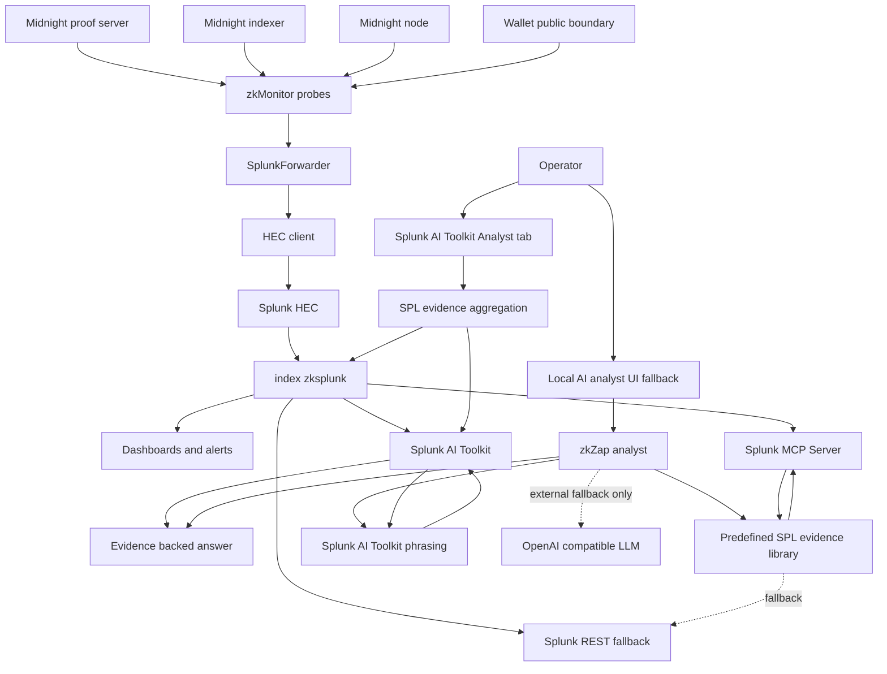
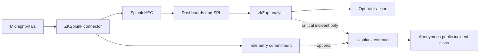
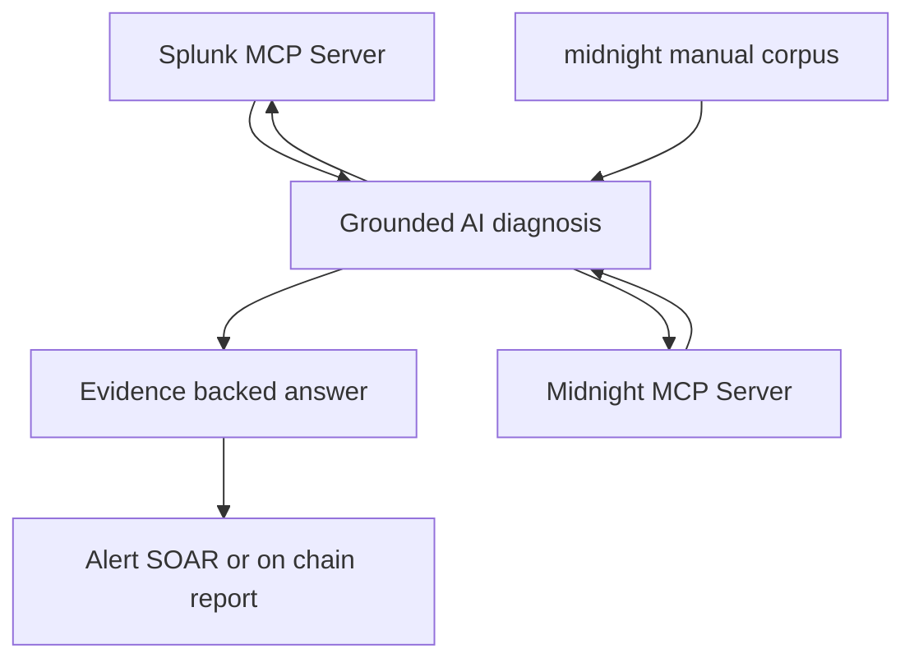

<div align="center">

# ZKSplunk

### *Splunking with Midnight*

**The world's first observability bridge between zero-knowledge blockchain infrastructure and Splunk — now with [zkZap](docs/ZKZAP_SECURITY_PROTOCOL.md), a privacy-native security layer.**

*You can't watch what you can't see. Unless you're us.*

<br/>

[](https://midnight.network)
[](https://splunk.com)
[](docs/ZKZAP_SECURITY_PROTOCOL.md)
[](https://docs.midnight.network/compact)
[](LICENSE)

<br/>

*Built for the [Splunk Agentic Ops Hackathon 2026](https://splunk.devpost.com/) by [EnterpriseZK Labs LLC](https://enterprisezk.com)*

</div>

---

<div align="center">

> *"Privacy is a feature. Observability is a superpower. zkZap turns both into a defense."*

</div>

---

## The Pitch (30 seconds)

Midnight is a **privacy-preserving blockchain** where computation happens inside zero-knowledge proofs — by design, you can't see what's happening inside. That's the whole point.

But operators still need to know: *Is the proof server alive? Why did that proof take 47 seconds? Is the wallet connected? Did a contract just go dark — or is someone attacking it?*

**ZKSplunk** is a purpose-built telemetry pipeline that understands ZK-proof lifecycles, shielded-state semantics, and privacy-preserving contracts — and streams that understanding into Splunk, where AI agents turn raw blockchain telemetry into autonomous incident response.

**zkZap** is the security layer on top: it re-reads that same telemetry as **threat signals** (proof floods, brute-force bursts, mint anomalies, wallet drains). Today it provides detection surfaces and an evidence-backed analyst loop; the planned response path is *observe → decide → act*, with **critical** incidents anchored on-chain as **anonymous, unlinkable attestations**: only the anonymized incident *class* is public (so the whole network gains awareness) — never the operator or node.

> **No one has built this before.** Splunk has connectors for Ethereum, Hyperledger, and Quorum. ZKSplunk is the **first connector for any ZK-proof blockchain infrastructure on Earth** — and zkZap is the first privacy-native SOC pattern for one.

---

## Current Status

ZKSplunk is a working local Splunk Enterprise observability app plus connector/agent code, with several forward-looking pieces clearly separated below.

| Area | Status | Notes |
|---|---|---|
| Live Midnight component monitoring | **Running / implemented** | `zkMonitor` / `realDeal` probes proof-server, indexer, node, and wallet-facing public metadata, then forwards events to Splunk HEC. |
| Splunk app dashboards | **Running / implemented** | `splunk-app/zksplunk` ships the `zksplunk` index, saved searches, alerts, component detail view, operator map, and packaged `.spl`. |
| Splunk-native AI Toolkit analyst tab | **Running / implemented** | `splunk-app/zksplunk` ships **ZKSplunk AI Toolkit Analyst**, a Splunk tab that aggregates `index=zksplunk` evidence and calls Splunk AI Toolkit `| ai` directly. Tested with connection `ZKSplunk2`: `provider=Gemini`, `model=gemini-3.5-flash`. |
| Local AI analyst chat | **Running / implemented** | `ai-agent` queries Splunk via MCP when configured, falls back to REST, and phrases evidence-backed answers through Splunk AI Toolkit `| ai`; external LLMs are fallback-only. |
| Splunk MCP integration | **Implemented for Splunk evidence** | The local analyst can use Splunk MCP or Splunk REST to gather evidence. |
| Dual MCP bridge: Splunk MCP + Midnight MCP | **Future / planned** | The cross-platform bridge described below is the target architecture: Splunk evidence plus Midnight MCP contract/docs/tooling context in one investigation loop. |
| On-chain attestation | **Partially complete** | `contract/src/zksplunk.compact` and commitment code exist, but the contract is not audited yet and the live production attestation flow is not treated as complete. |
| zkZap automated response / SOAR | **Future / planned** | Detection concepts and alert surfaces exist; automated SOAR/on-chain response remains future work. |

---

## Architecture

Two implemented flows run through ZKSplunk today: a **telemetry ingestion** path (green) that streams Midnight infrastructure health into Splunk, and an **AI analyst** path (orange) where operators ask questions inside the Splunk app. The primary analyst surface is the **ZKSplunk AI Toolkit Analyst** tab, which runs SPL over `index=zksplunk` and invokes Splunk AI Toolkit with `| ai prompt="{prompt}" provider=Gemini model=gemini-3.5-flash`. The local `ai-agent` chat remains available for the MCP-backed flow and also prefers Splunk AI Toolkit for phrasing. The dual Splunk MCP + Midnight MCP bridge is shown as the planned extension point, not as a completed production bridge.

The full hackathon-required architecture diagram lives at [`architecture_diagram.md`](architecture_diagram.md). It shows the live Midnight telemetry path into Splunk HEC, the Splunk app surfaces, and the runtime AI analyst path through Splunk MCP Server.



| Layer | Package | Role |
|-------|---------|------|
| Collector | `zkMonitor/` | probes live Midnight infra, emits `VitalCheckResult`s |
| Forwarder | `connector/` | adapts + ships events to Splunk HEC (+ optional on-chain attestation) |
| Shared types | `vitals/` | `VitalCheckResult` and event schemas |
| Storage + UI | `splunk-app/zksplunk/` | `index=zksplunk`, dashboards, alerts, saved searches |
| Splunk-native analyst | `splunk-app/zksplunk/default/data/ui/views/zksplunk_ai_toolkit_analyst.xml` | Splunk tab that asks questions over `index=zksplunk` and calls Splunk AI Toolkit `| ai` directly |
| AI agent | `ai-agent/` | zkZap analyst chat — queries Splunk via MCP/REST and prefers Splunk AI Toolkit for answer phrasing |
| On-chain | `contract/` | Compact contract for anonymous, unlinkable critical-incident attestation; **partial**, not audited yet |

> A simulated, offline twin of the collector lives in `demoLand/` — same `connector`/`vitals` code, mock source and local sink. See [`docs/DEMOLAND_VS_ZKMONITOR.md`](docs/DEMOLAND_VS_ZKMONITOR.md).

---

## ZKSplunk observes · zkZap responds

ZKSplunk observes public infrastructure metadata and forwards it to Splunk; zkZap responds by reading those Splunk signals as operational and security evidence. The diagrammed version of this flow is included in [`architecture_diagram.md`](architecture_diagram.md).



Two lenses over **one** pipeline:

| | **ZKSplunk Me** | **ZKSplunk Macro** |
|---|---|---|
| Who | An individual DApp / operator | Ecosystem watchers (DevRel / elected) |
| Sees | Its *own* stack (consented self-monitoring) | Public chain `Effects` + infra health |
| Catches | Local brute-force, wallet drain, proof abuse | Systemic floods, mint storms, outages |
| Privacy | Never reads private state | Built from public data — nobody shares secrets |

Target flow: operators emit **anonymous, unlinkable critical-incident attestations** — only the anonymized incident *class* is published on-chain (the operator and node never are), proven via zero-knowledge **set-membership + a nullifier**. The Compact contract and commitment code are present, but this attestation path is **partially complete and unaudited**. The Macro aggregation view remains future work. (See [`docs/ZKZAP_SECURITY_PROTOCOL.md`](docs/ZKZAP_SECURITY_PROTOCOL.md) §3.3.)

---

## Why This Matters

Zero-knowledge blockchains have a fundamental operational paradox:

| Challenge | Why it's unique to ZK |
|-----------|----------------------|
| **Proofs take 17–28 s** | Traditional chains confirm in milliseconds; ZK proofs are expensive and can fail silently mid-generation. |
| **Proof servers are fragile** | Docker containers running Halo 2 / UltraPlonk circuits that OOM or crash with zero external signal. |
| **Private state is invisible by design** | You *cannot* inspect a shielded contract's state — that's the guarantee, and the debugging nightmare. |
| **Attacks hide in the metadata** | You can't see *what* an attacker tried — but failed/rejected calls, mint spikes, and unshielded drains **are** public. zkZap watches those. |

Traditional observability sees HTTP 200s and container uptime. It has **zero** understanding of proof lifecycles, circuit pipelines, or shielded-state transitions. ZKSplunk translates that entire domain into Splunk's language.

---

## What We Can Glean from the Public Ledger

Midnight is a privacy chain, so the governing rule is simple: **metadata and volumes are public, contents are private.** That public surface is enough to fight on-chain attacks and outages without ever touching private state. Full reference: [`docs/PUBLIC_LEDGER_OBSERVABILITY.md`](docs/PUBLIC_LEDGER_OBSERVABILITY.md).

**Three public layers we read:**

| Layer | Public signal | Source |
|-------|---------------|--------|
| **Per-call `Effects`** | which contract + circuit fired & how often; mint amounts; unshielded (addr + amount); shielded spend activity | `midnight-ledger` spec |
| **Transaction status** | `failure` (rejected by ledger rules, lands in a block) and `rejected` (never included) | tx lifecycle |
| **Indexer + block data** | block height/cadence/author, contract state transitions, epoch timing, DUST generation health | indexer GraphQL |

**What stays invisible by design:** private state plaintext, circuit arguments (the witness), and the parties/amounts of *shielded* transfers. We never claim to detect stealthy attacks on private state — that's impossible on a privacy chain, and saying otherwise would be dishonest.

**Public signal → detection map:**

| Threat / outage | Public evidence | Field |
|-----------------|-----------------|-------|
| Failed-auth / brute force | failed/rejected calls to one entry point | `claimed_contract_calls` + tx status |
| Contract griefing / spam | abnormal call-rate, rising failure ratio | `claimed_contract_calls` |
| Mint anomaly | mint-rate / amount spike | `shielded_mints` / `unshielded_mints` |
| Wallet drain (unshielded) | rapid drawdown (addr + amount) | `claimed_unshielded_spends` |
| Wallet drain (shielded) | nullifier burst (amounts hidden) | `claimed_nullifiers` |
| Indexer / network outage | block height stalls, sync lag, reconnect storm | `Block.height` / `timestamp` |
| Consensus / liveness anomaly | block cadence + epoch drift | `Block`, `EpochInfo` |
| Fee-resource starvation | DUST generation stalls vs NIGHT registered | `DustGenerationStatus` |
| Proof-server flood (DDoS) | latency spike + queue depth (operator-side) | MidnightVitals local |

---

## Hackathon Tracks — Why We Win

> Rules confirmed **May 13, 2026** · Sponsor: **Cisco** · Submission deadline **June 15, 2026** · Team cap: 2

| Track | Prize | Our Edge |
|---|---|---|
| **🏆 Grand Prize** | **$7,000** + .conf26 | An entirely **new observability domain** (ZK-proof infrastructure) + production-grade code + a privacy-native security layer (zkZap). |
| **🥇 Best of Observability** | **$3,000** + .conf26 | **Home turf.** First Splunk connector for ZK infra — purpose-built field extraction, saved searches, dashboards, alerts, and a partial tamper-evident attestation layer. |
| **Best Use of Splunk MCP Server** | **$1,000** | Current: Splunk MCP-backed analyst over ZKSplunk evidence. Future: **Splunk MCP + Midnight MCP** bridge for cross-platform diagnostics neither server could do alone. |
| **Most Valuable Feedback** | $200 ×5 | Thoughtful, actionable feedback during the feedback period. |

*Allowed stack: one Grand + one Bonus. We aim Grand-first, with Observability as the safe floor.*

---

## What Gets Monitored

### Proof Server — the heart of ZK
| Metric | Tells you | Why it matters |
|--------|-----------|----------------|
| `proof.server.status` | alive / degraded / dead | Is the prover container running? |
| `proof.server.latency_ms` | response time to `:6300` | Latency spikes predict OOM crashes |
| `proof.generation.duration_s` | last proof time | Normal 17–28 s; >45 s = trouble |
| `proof.generation.success` | did it verify? | Silent failures are the #1 ZK hazard |

### Wallet · Network · Contracts
| Metric | Tells you |
|--------|-----------|
| `wallet.connected` / `wallet.balance_dust` | Can the user transact / pay fees? |
| `network.indexer.status` / `network.sync_lag_s` | Is the indexer healthy and current? |
| `contract.readable` / `contract.last_interaction` | Is the deployed contract responsive? |

### zkZap threat signals (the security lens)
| Signal | Observable evidence |
|--------|---------------------|
| **proof-flood** | sustained proof-server latency blow-up |
| **failed-auth-bruteforce** | burst of failed/rejected calls to one entry point |
| **wallet-drain** | rapid `claimed_unshielded_spends` (addr + amount public) |
| **mint-anomaly** | `shielded_mints` / `unshielded_mints` rate spike |
| **indexer-outage** | health-check failures + growing sync lag |

---

## On-Chain Schema — `contract/src/zksplunk.compact`

Status: **partially complete, not audited yet**. The contract and commitment code define the intended tamper-evident anchoring layer, but this is not yet a production-audited attestation system.

Design intent: telemetry lives off-chain (Splunk); only **commitments** and incident state go on-chain. Built on the Brick-Towers sealed-ledger + `persistentHash`-derived public-key patterns (`pragma language_version >= 0.16 && <= 0.23`).

```
enum Severity         { info, warning, degraded, critical, outage }
enum IncidentStatus   { open, acknowledged, mitigated, resolved }

sealed ledger networkId, adminPublicKeyHash, observabilitySchemaVersion
ledger monitors, attestationCount, attestations,
       incidents, incidentStatuses, incidentSeverities, incidentCount
```

| Circuit | Role |
|---------|------|
| `registerMonitor` / `revokeMonitor` | Admin manages the monitor registry (by derived key hash) |
| `attestObservation(commitment)` | A monitor anchors a telemetry snapshot commitment + sequence |
| `reportIncident(id, severity, commitment)` | zkZap opens a tamper-evident incident |
| `updateIncidentStatus(id, status)` | open → acknowledged → mitigated → resolved |

Off-chain commitments use canonical hashing (`telemetry-commitment.ts`) so an auditor can independently re-hash the Splunk data and verify it matches what was attested at that block height. This verification model still needs audit and end-to-end production validation.

---

## The Secret Weapon: MCP Bridge

ZKSplunk already uses a local AI analyst over Splunk evidence. The next step is the dual-MCP bridge: two Model Context Protocol servers feeding one bidirectional AI intelligence layer.

The implemented loop uses Splunk MCP or Splunk REST evidence today. The planned extension adds Midnight MCP context to the same investigation loop.



Current loop: **detect** in Splunk → **investigate** via Splunk MCP/REST evidence → **respond** with operator guidance. Planned bridge: add Midnight MCP + the `mnm` corpus for contract/docs/tooling context, then correlate and respond through alert / SOAR / on-chain `reportIncident`. Neither MCP can do this alone — the *bridge* is the innovation, and it is future work.

---

## Run It: demoLand / zkMonitor

ZKSplunk follows the DIDzMonolith **demoLand / zkMonitor** convention. Both sides share the same `connector` / `vitals` / `contract` code — only the *source* and *sink* change. Full architecture: [`docs/DEMOLAND_VS_ZKMONITOR.md`](docs/DEMOLAND_VS_ZKMONITOR.md).

```bash
# demoLand — simulated, offline, safe to record. Runs the zkZap attack scenarios.
cd demoLand && npm install && npm run demo:dashboard
#   → console events + out/events.jsonl + a tabbed metrics dashboard (out/dashboard.html)

# zkMonitor — live vitals → real Splunk HEC (+ optional experimental attestation)
cd zkMonitor && cp .env.zkmonitor .env   # set SPLUNK_HEC_TOKEN, then:
npm install && npm run start
```

| | demoLand | zkMonitor |
|---|----------|----------|
| Vitals source | `MockVitalsProvider` | live HTTP checks |
| Splunk sink | console + `out/events.jsonl` | real Splunk Cloud HEC |
| Attestation | `MockAttestationClient` | experimental; contract exists, not audited yet |
| Infra needed | none | Midnight Docker + Splunk Cloud |

### Offline metrics dashboard
`npm run demo:dashboard` emits a **self-contained** `out/dashboard.html` (no CDNs — inline SVG) with a tab per metric — safe to show on a recorded demo:

| Tab | Shows |
|-----|-------|
| **Proof Latency** | proof-server response time + 2 s threshold |
| **zkZap Incidents** | incidents grouped by threat type |
| **Vital Health** | status mix per vital + overall health % |
| **Attestations** | cumulative on-chain commitments + avg attest latency |

---

## Drop-In Integration (3 lines)

```tsx
const forwarder = new SplunkForwarder(config, { dappName: 'BlindOracle', environment: 'production' });
await forwarder.connect();

<VitalsProvider splunkCallbacks={{
  onVitalCheck: forwarder.handleVitalCheck,
  onLogEntry: forwarder.handleLogEntry,
  onDiagnosticReport: forwarder.handleDiagnosticReport,
}}>
  <App />
</VitalsProvider>
```

Every vital check, log entry, and diagnostic report flows to Splunk automatically. Any Midnight DApp is a candidate integration (see [`docs/CANDIDATE_INTEGRATIONS.md`](docs/CANDIDATE_INTEGRATIONS.md)).

---

## Technology Stack

| Layer | Technology | Role |
|-------|------------|------|
| Telemetry source | [MidnightVitals](https://github.com/bytewizard42i/MidnightVitals) | React 18 / TS 5 diagnostic console |
| Blockchain | [Midnight Network](https://midnight.network) | Privacy-preserving L1 (Cardano partner chain) |
| Smart contracts | [Compact](https://docs.midnight.network/compact) **v0.23** | ZK-proof DSL (`>= 0.16 && <= 0.23`) |
| ZK proving | Midnight Proof Server | Halo 2 / UltraPlonk prover (Docker) |
| Wallet / SDK | Lace + Midnight.js | Keys, coin selection, ZSwap |
| Ingestion | Splunk HEC | Batched, retrying HTTP Event Collector |
| Analytics | Splunk Cloud | Dashboards, SPL, saved searches |
| AI | Splunk MCP / Splunk REST + Splunk AI Toolkit `| ai` | Current local analyst over Splunk evidence; external LLM only as fallback |
| Future AI | Splunk MCP + Midnight MCP | Planned dual-MCP bridge with `midnight-manual` grounding |
| Future automation | Splunk SOAR + zkZap | Planned playbook + on-chain incident response |

---

## What's Already Built

This isn't a pitch deck — it's working, type-checked code.

- **`connector/`** — production HEC client (batch + exponential retry + heartbeat), `SplunkForwarder` lifecycle, type-safe `vitals-adapter`, canonical `telemetry-commitment`, `attestation-client`, **14** field extractions + **11** SPL saved searches.
- **`contract/`** — `zksplunk.compact` (sealed ledger + `persistentHash` keys; lifecycle circuits; `Severity` / `IncidentStatus` enums). The contract is present but **not audited yet**; live production attestation remains partial.
- **`vitals/`** — full MidnightVitals module (mock + live provider interface, UI components).
- **`demoLand/` + `zkMonitor/`** — offline simulated runner with **zkZap attack scenarios** + a tabbed metrics dashboard, and live HTTP→HEC wiring.
- **`splunk-app/zksplunk/`** — installable Splunk app with global operator map, component detail dashboard, overview dashboard, saved searches, alert configuration, and packaged `.spl`.
- **`ai-agent/`** — local analyst chat over Splunk evidence using Splunk MCP when configured, REST fallback otherwise, and Splunk AI Toolkit `| ai` phrasing when enabled.

## Future / Planned

- **Dual MCP bridge** — combine Splunk MCP evidence with Midnight MCP contract/docs/tooling context in one agent loop.
- **Audited on-chain attestation** — audit and harden `zksplunk.compact`, then validate live attestation end to end.
- **zkZap automated response** — turn detections into Splunk SOAR playbooks and optional on-chain `reportIncident` calls.
- **Macro consortium view** — aggregate anonymous incident classes across operators without exposing node/operator identity.

---

## Project Structure

```
ZKSplunk_Splunking_w_Midnight/
├── connector/        # HEC client, forwarder, adapter, commitments, attestation
├── vitals/           # MidnightVitals: provider interface + mock + UI
├── contract/         # zksplunk.compact (attestations + incidents)
├── demoLand/         # simulated runner + zkZap scenarios + dashboard generator
├── zkMonitor/         # live vitals → Splunk HEC
├── splunk-app/       # Splunk app dashboards, alerts, saved searches, .spl package
├── ai-agent/         # local analyst over Splunk MCP/REST evidence
└── docs/             # PUBLIC_LEDGER_OBSERVABILITY · ZKZAP_SECURITY_PROTOCOL · DEMOLAND_VS_ZKMONITOR · CANDIDATE_INTEGRATIONS · ai-chat/
```

---

## Roadmap

| Phase | Window | Goal |
|-------|--------|------|
| **Build sprint** | now → Jun 13 | End-to-end live telemetry, Splunk app dashboards, local analyst loop |
| **Submit** | Jun 13 → Jun 15 | Demo video, `architecture_diagram` at root, public repo, Devpost submission |
| **Post-hackathon** | — | Dual-MCP bridge, contract audit, SOAR playbooks, Splunkbase publish, opt-in Macro consortium, cross-ZK-chain support |

---

## Part of Something Bigger

ZKSplunk is part of the [DIDzMonolith](https://github.com/bytewizard42i/DIDzMonolith) ecosystem — privacy-preserving products + books, all on Midnight (see [`DIDzMonolith_overview.md`](../DIDzMonolith_overview.md)). It's the **operational spine**: any product with a contract in a production loop can stream MidnightVitals → ZKSplunk, and zkZap then provides privacy-preserving incident awareness across the whole suite.

---

## License

Apache 2.0 — see [LICENSE](LICENSE).

Built by [EnterpriseZK Labs LLC](https://enterprisezk.com) and Alex Pestchanker.
