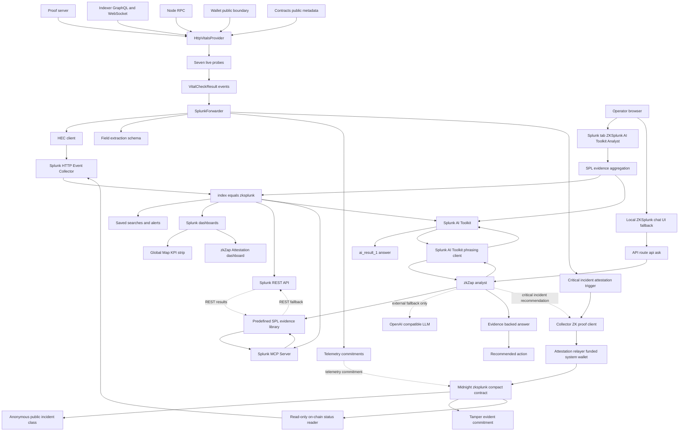

# ZKSplunk Architecture Diagram

This is the required hackathon architecture diagram file. It shows how ZKSplunk
interacts with Splunk, how the Splunk-native AI Toolkit analyst is integrated,
and how data flows between the Midnight infrastructure, ZKSplunk services,
Splunk, the AI analyst paths, and the demo on-chain attestation path.

For VS Code Mermaid preview, open [`architecture_diagram.mmd`](architecture_diagram.mmd).
This `.md` file is kept at the repository root because the hackathon rules
require `architecture_diagram.md`, `architecture_diagram.pdf`, or
`architecture_diagram.png`.

## Runtime Flow

1. `zkMonitor` probes live Midnight infrastructure: proof server, indexer, node,
   wallet public boundary, contract monitorability, block cadence, and version
   metadata.
2. The `connector` converts those observations into Splunk HEC events and sends
   them to `index=zksplunk`.
3. The Splunk app provides dashboards, saved searches, and alert surfaces over
   that live telemetry. The Global Map includes the KPI strip below the map:
   critical components, proof/indexer p95 latency, HEC failures, Midnight
   contract state, and on-chain attestation count.
4. The primary operator path is the **ZKSplunk AI Toolkit Analyst** tab inside
   the Splunk app. It aggregates live `index=zksplunk` evidence with SPL and
   calls Splunk AI Toolkit directly with
   `| ai prompt="{prompt}" provider=Gemini model=gemini-2.5-flash`.
5. The local `ai-agent` chat remains available at `localhost:8787`. It uses
   Splunk MCP Server at runtime to run SPL against live Splunk evidence. If MCP
   is not configured, it falls back to Splunk REST for evidence.
6. Answer phrasing prefers Splunk AI Toolkit. External OpenAI-compatible LLMs
   are fallback-only and never supply facts. The live facts, health status,
   counts, and latency claims come from Splunk evidence.
7. The demo on-chain attestation path deploys/registers `zksplunk.compact`,
   relays critical-incident proofs through a funded system wallet, and runs a
   read-only on-chain status reader that emits `zksplunk:onchain` events back
   into Splunk. Private Midnight state, witness values, shielded parties, and
   shielded amounts are never observed. The contract is not audited yet.
